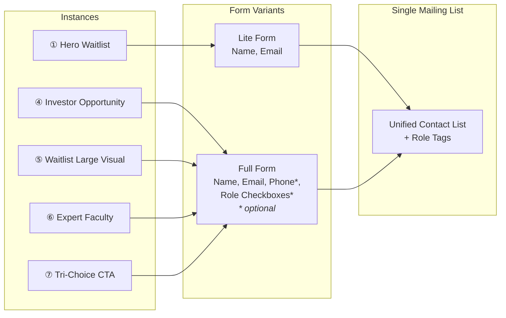

# New CTA Placement Recommendation — The F.A.M. Project Website

This report recommends placements for the new CTA instances described in [`TheFamProject website copy.md`](scratchpad/TheFamProject%20website%20copy.md), replacing all **10 existing form-based CTA placements** catalogued in the [prior CTA audit](CTA-report.md).

> **Definition:** Consistent with the CTA audit, a **CTA** in this report means a **form submission area** — a section containing input fields and a submit button. Navigation links, "Learn More" buttons, and other non-form elements are not counted as CTAs. Recommendations for non-form changes (e.g., header button text, narrative content swaps) are listed separately in the [Additional Recommendations](#additional-recommendations-non-form-changes) section.

---

## Executive Summary

The website transitions from **5 form-based CTA types across 10 placements** (backed by 4 form components) to **3 conversion goals delivered through 5 CTA instances across 9 form placement locations**, all feeding a **single unified mailing list** with role-based segmentation via optional checkboxes.

### The 3 New Conversion Goals

| ID | Conversion | Audience | Replaces |
|----|-----------|----------|----------|
| **A** | FamCentral Waitlist | Parents & families | Old ① Newsletter, Old ⑤ Free Guide |
| **B** | Become an Investor | Business owners, investors | Old ③ Fundraising Inquiry |
| **C** | Expert Faculty Application | Experts, authors, content creators | Old ④ Sponsor/Partner |

### Unified Form Strategy

All instances feed into **one mailing list** using a **tiered form approach** — two variants of the same form, differentiated by funnel position:

| Variant | Context | Fields | Used By |
|---------|---------|--------|---------|
| **Lite** | Top-of-funnel (high-exposure, first-touch) | Name, Email | Instance 1 (hero), Instance 1 (article detail), Footer |
| **Full** | Bottom-of-funnel (high-intent, self-selected) | Name, Email, Phone *(optional)*, Role checkboxes *(optional)* | Instance 4, 5, 6, 7 |

#### Role Checkboxes (Full variant only, all optional — "select all that apply")

- ☐ Parent / Family Member
- ☐ Business Owner
- ☐ Interested in Investing
- ☐ Expert / Content Creator

> **Rationale:** A single list with self-segmenting checkboxes captures the multi-hat reality (a parent *is also* a business owner *is also* interested in investing) while keeping the backend simple. The lite variant maximizes top-of-funnel volume; the full variant collects richer data from committed visitors. Phone is optional everywhere to reduce friction. Role data from lite signups can be collected via autoresponder follow-up email.

### The CTA Instances Used for Form Replacements

| Instance | Name | Form Variant | Placements |
|----------|------|-------------|------------|
| **1** | Hero Waitlist CTA | Lite | 2 (Homepage hero, Article detail) |
| **4** | Investor Opportunity | Full | 1 (Projects §6) |
| **5** | Waitlist — Large Visual | Full | 2 (Our Mission bottom, Events §5–7) |
| **6** | Expert Faculty | Full | 1 (Events §8) |
| **7** | Final Tri-Choice CTA | Full | 3 (Homepage bottom, Contact page, Footer) |

**Total form CTA placements: 9** (replacing the original 10 — Events §5 and §7 consolidate into 1)

> **Note:** Instances 2 (The Movement) and 3 (Introducing FamCentral) from the new CTA copy document are narrative content sections. They do not replace existing form CTAs and are addressed separately in [Additional Recommendations](#additional-recommendations-non-form-changes).

---

## Old → New Disposition (Every Old Form CTA Accounted For)

| Old CTA | Old Location | New Instance | New Location | Notes |
|---------|-------------|-------------|-------------|-------|
| ①-1 Newsletter (hero) | Homepage hero | **Instance 1** (Lite) | Homepage hero | Waitlist form replaces newsletter form |
| ①-2 Newsletter (footer) | Footer (every page) | **Instance 7** (compact) | Footer (every page) | Tri-choice links replace email-only form |
| ①-3 Newsletter (events list) | Events §7 | **Instance 5** (Full) | Events §5–7 consolidated | Waitlist replaces events newsletter |
| ①-4 Newsletter (article) | Article detail banner | **Instance 1** (Lite) | Article detail banner | Compact waitlist replaces newsletter |
| ②-1 General Contact | Homepage bottom | **Instance 7** (Full) | Homepage bottom | Tri-choice replaces general contact form |
| ②-2 General Contact | Our Mission bottom | **Instance 5** (Full) | Our Mission bottom | Waitlist replaces general contact form |
| ②-3 General Contact | Contact page | **Instance 7** (Full) | Contact page | Tri-choice replaces general contact form |
| ③-1 Fundraising | Projects §6 | **Instance 4** (Full) | Projects §6 | Investor CTA replaces fundraising form |
| ④-1 Sponsor/Partner | Events §8 | **Instance 6** (Full) | Events §8 | Expert Faculty replaces sponsor outreach |
| ⑤-1 Free Guide | Events §5 | **Instance 5** (Full) | Events §5–7 consolidated | Waitlist replaces guide download |

---

## Placement Architecture



---

## Detailed Placements by Page

---

### 1. Homepage ([`index.astro`](src/pages/index.astro))

The homepage has 2 existing form CTAs to replace. It receives 2 new form CTA instances.

#### Placement 1 → Instance 1 (Hero Waitlist CTA) — Lite Form

| | |
|---|---|
| **Replaces** | Old ①-1 — Newsletter signup in hero right column ([line 67–74](src/pages/index.astro:67)) |
| **Section** | Hero section, right-column card (same grid position) |
| **Headline** | "A Movement to Strengthen Families Has Begun" |
| **Subheadline** | FamCentral launch announcement — "Now you can join the movement — and even become an owner." |
| **Copy** | Waitlist benefits: early access, event invitations, Look Up Challenge guide, offers, updates |
| **Form** | **Lite:** Name, Email → "Join the Waitlist →" button |
| **Congruence** | ✅ Hero is the highest-impact spot. The opening statement about the movement + platform launch immediately communicates purpose and invites action. Replaces the vague "Get Involved! Subscribe to our FAMatics Newsletter" with a concrete, benefit-driven offer. Lite form keeps friction minimal at first touch. |

#### Placement 2 → Instance 7 (Final Tri-Choice CTA) — Full Form

| | |
|---|---|
| **Replaces** | Old ②-1 — "Interested in learning more?" [`CloudsCTA`](src/components/CloudsCTA.astro) + [`FormContact`](src/components/FormContact.astro) ([line 317–323](src/pages/index.astro:317)) |
| **Section** | Bottom of page (final section before footer) |
| **Headline** | "Join the Movement" |
| **Copy** | "There are three powerful ways you can participate:" → 1. Join the FamCentral Waitlist, 2. Become an Owner (invest), 3. Apply to join our Expert Faculty |
| **Form** | **Full:** Name, Email, Phone *(optional)*, Role checkboxes *(optional)* — the checkboxes here double as the "choice" mechanism, pre-selecting based on which option the visitor clicks |
| **Buttons** | "Join the Waitlist" · "Become an Investor" |
| **Congruence** | ✅ After the full homepage journey (hero → mission → stats → events → testimonials → video → products), the visitor is offered 3 clear paths forward. This replaces a vague "Interested in learning more?" with specific, actionable conversion options. The full form with checkboxes is appropriate here — visitors at the bottom of the homepage are committed. |

#### Homepage Section Flow (New)

```
┌──────────────────────────────────────────┐
│  ★ INSTANCE 1 — Hero Waitlist CTA        │  ← Lite form (Name, Email)
│  "A Movement to Strengthen Families..."  │     Replaces old ①-1
├──────────────────────────────────────────┤
│  Mission section                         │  ← Unchanged (or see Additional Recs)
├──────────────────────────────────────────┤
│  "Did You Know?" statistics section      │  ← Unchanged
├──────────────────────────────────────────┤
│  FAMtopia Events & Workshops             │  ← Unchanged
├──────────────────────────────────────────┤
│  Jashin Howell Testimonial               │  ← Unchanged
├──────────────────────────────────────────┤
│  Video section (Vimeo)                   │  ← Unchanged
├──────────────────────────────────────────┤
│  Our Projects section                    │  ← Unchanged (or see Additional Recs)
├──────────────────────────────────────────┤
│  ★ INSTANCE 7 — Tri-Choice CTA           │  ← Full form with checkboxes
│  "Join the Movement"                     │     Replaces old ②-1
└──────────────────────────────────────────┘
```

---

### 2. Our Mission ([`our-mission.astro`](src/pages/our-mission.astro))

Single form CTA at the bottom, replacing the existing general contact form.

#### Placement 3 → Instance 5 (Waitlist — Large Visual) — Full Form

| | |
|---|---|
| **Replaces** | Old ②-2 — "Inspired by our mission? Want to get involved?" [`CloudsCTA`](src/components/CloudsCTA.astro) + [`FormContact`](src/components/FormContact.astro) ([line 193–200](src/pages/our-mission.astro:193)) |
| **Section** | Bottom of page (final section before footer) |
| **Headline** | "Join the FamCentral Founding Community" |
| **Copy** | "Thousands of parents are already committing to build stronger families..." + benefits list (early access, events, Look Up Challenge toolkit, offers, founder updates) |
| **Form** | **Full:** Name, Email, Phone *(optional)*, Role checkboxes *(optional)* |
| **Congruence** | ✅ The Our Mission page is deeply emotional — it covers family disconnection, statistics on device addiction, and a vision for change. After absorbing all that, "Join the FamCentral Founding Community" is a high-emotion close that leverages the visitor's built-up motivation. The "founding community" framing rewards the visitor for caring about the mission. The full form is appropriate — visitors who read the entire mission page are highly committed. |

---

### 3. Events ([`events.astro`](src/pages/events.astro))

Consolidates from 3 form CTAs to 2, reducing clutter while maintaining conversion paths.

#### Placement 4 → Instance 5 (Waitlist — Large Visual) — Full Form

| | |
|---|---|
| **Replaces** | Old ⑤-1 — Free Guide / "Crafting Your Living Legacy" purple card ([line 212–218](src/pages/events.astro:212)) **AND** Old ①-3 — "Subscribe to The FAM Events List" newsletter ([line 242–247](src/pages/events.astro:242)) |
| **Section** | Consolidates §5 (My FAM Legacy area) and §7 (ropes-course events list) into a single section in the §5 position |
| **Headline** | "Join the FamCentral Founding Community" |
| **Copy** | Same as Instance 5 on Our Mission — benefits include "invitations to local events" which is directly relevant to the events page |
| **Form** | **Full:** Name, Email, Phone *(optional)*, Role checkboxes *(optional)* |
| **Congruence** | ✅ The events page is about community engagement — workshops, retreats, family activities. Instance 5's benefits include "invitations to local events" and "the Look Up Challenge toolkit," which are directly relevant. Consolidating the old "Free Guide" and "Events newsletter" CTAs eliminates the copy-paste confusion (the old events list CTA had the wrong button text) and provides a single, clear call to action. |

> **⚠️ Design note:** The existing "My FAM Legacy" content (§5 left column text) and the "Brandon Lee Quote" testimonial (§6) can remain. Instance 5 replaces only the purple CTA card in the right column of §5 and absorbs the entirety of §7. The section count drops from 8 to 7.

#### Placement 5 → Instance 6 (Expert Faculty) — Full Form

| | |
|---|---|
| **Replaces** | Old ④-1 — "Interested in being an event sponsor, venue, or partner?" [`CloudsCTA`](src/components/CloudsCTA.astro) + [`FormSponsor`](src/components/FormSponsor.astro) ([line 251–264](src/pages/events.astro:251)) |
| **Section** | §8 → now §7 (final section, clouds background) |
| **Headline** | "Join Our Expert Faculty — Help Strengthen Families Nationwide" |
| **Copy** | Expert network description + areas of expertise (Parenting & Family Relationships, Mental Health & Emotional Wellness, Faith & Values-Based Living, Digital Wellness & Screen-Time Balance, Education/Safety/Child Development, Health/Nutrition/Family Wellness) + invitation to apply |
| **Form** | **Full:** Name, Email, Phone *(optional)*, Role checkboxes *(optional)* — the "Expert / Content Creator" checkbox would be pre-checked for this instance |
| **CTA Button** | "Apply to Join the Expert Faculty" |
| **Congruence** | ✅ Both the old and new CTAs target **professional collaborators**. The events page context (workshops, retreats, educational series) naturally leads to "share your expertise at these events and on the platform." The shift from venue sponsors to expert faculty reflects the broader strategic pivot from events-only to the FamCentral platform. |

#### Events Section Flow (New)

```
┌──────────────────────────────────────────┐
│  FAMtopia Hero (wave-lines bg)           │  ← Unchanged
├──────────────────────────────────────────┤
│  Quote + Workshops & Retreats            │  ← Unchanged
├──────────────────────────────────────────┤
│  Flagship Trilogy Event Series           │  ← Unchanged
├──────────────────────────────────────────┤
│  "Workshops Coming Soon!" banner         │  ← Unchanged
├──────────────────────────────────────────┤
│  My FAM Legacy text + ★ INSTANCE 5       │  ← Full form (waitlist)
│  (replaces old purple card + §7)         │     (consolidates ⑤-1 + ①-3)
├──────────────────────────────────────────┤
│  Brandon Lee Quote                       │  ← Unchanged
├──────────────────────────────────────────┤
│  ★ INSTANCE 6 — Expert Faculty           │  ← Full form (apply)
│  "Join Our Expert Faculty"               │     (replaces ④-1)
└──────────────────────────────────────────┘
```

---

### 4. Projects ([`projects.astro`](src/pages/projects.astro))

Single form CTA replacement in the fundraising section.

#### Placement 6 → Instance 4 (Investor Opportunity) — Full Form

| | |
|---|---|
| **Replaces** | Old ③-1 — "Learn more about our fundraising opportunities" [`FormFundraising`](src/components/FormFundraising.astro) ([line 200–203](src/pages/projects.astro:200)) |
| **Section** | §6 (Fundraising section, `bg-fam-cream`) |
| **Headline** | "Become an Owner in the Movement" |
| **Copy** | Investment opportunity description + Wefunder announcement + investor benefits (equity, early access, perks, ad credits, shape the future) |
| **Form** | **Full:** Name, Email, Phone *(optional)*, Role checkboxes *(optional)* — the "Interested in Investing" checkbox would be pre-checked for this instance |
| **Secondary CTA** | "View Investment Opportunity" link → Wefunder (external) — placed alongside or below the form |
| **Congruence** | ✅ The Projects page showcases FAM's products (Fun Pass, Central, vendor partnerships). After evaluating these products — which demonstrate market viability and platform breadth — the visitor is invited to invest. The "Become an Owner" CTA naturally follows "here's what we've built." The full form captures investor interest directly while the Wefunder link provides the external investment pathway. |

---

### 5. Contact ([`contact.astro`](src/pages/contact.astro))

Full page form CTA replacement — the contact page becomes the "participation hub."

#### Placement 7 → Instance 7 (Final Tri-Choice CTA) — Full Form

| | |
|---|---|
| **Replaces** | Old ②-3 — "Want to get involved? We want to hear from you!" [`CloudsCTA`](src/components/CloudsCTA.astro) + [`FormContact`](src/components/FormContact.astro) ([line 8–18](src/pages/contact.astro:8)) |
| **Section** | Full page content (this is the page's only section) |
| **Headline** | "Join the Movement" |
| **Copy** | "There are three powerful ways you can participate:" → 1. Join the FamCentral Waitlist (for families), 2. Become an Owner (invest via Wefunder), 3. Apply to join our Expert Faculty (share your expertise) |
| **Form** | **Full:** Name, Email, Phone *(optional)*, Role checkboxes *(optional)* |
| **Buttons** | "Join the Waitlist" · "Become an Investor" |
| **Congruence** | ✅ The old contact page was a generic "send us a message" form with no specific direction. Instance 7 transforms it into a purposeful decision point — visitors arriving via the header button get 3 clear, actionable paths. The checkboxes let visitors self-identify their role(s), and the form captures their info regardless of which path they choose. |

> **⚠️ Design note:** Consider whether the clouds background ([`CloudsCTA`](src/components/CloudsCTA.astro)) visual treatment should be retained, or whether a fresh layout better suits the tri-choice format. Instance 7 describes 3 choices with descriptions + a single form, which may work well as a card-based layout (3 option cards above, single form below) rather than the current two-column clouds design.

---

### 6. Article Detail ([`[...slug].astro`](src/pages/articles/[...slug].astro))

Post-article form CTA replacement in the red banner below article content.

#### Placement 8 → Instance 1 (Hero Waitlist CTA — compact variant) — Lite Form

| | |
|---|---|
| **Replaces** | Old ①-4 — "Sign up for our Newsletter" red banner with [`FormNewsletter`](src/components/FormNewsletter.astro) ([line 185–195](src/pages/articles/[...slug].astro:185)) |
| **Section** | Red banner below article body (overlapped by floating article card) |
| **Headline** | "Join the FamCentral Waitlist" (condensed from Instance 1's full headline) |
| **Copy** | Abbreviated: "Be among the first families to experience the platform. Get early access, event invitations, and the Look Up Challenge guide." |
| **Form** | **Lite:** Name, Email → "Join the Waitlist →" button |
| **Congruence** | ✅ Article readers are already engaged with family-wellness content (digital distraction, screen time, building relationships, parenting tips). They're pre-qualified for the FamCentral value proposition. The lite form keeps friction minimal — article readers are mid-browse, not in "fill out a detailed form" mode. The existing red banner visual treatment works well — just swap the copy and form label. |

> **⚠️ Design note:** Instance 1's full copy (headline + subheadline + benefits list) is too long for this compact placement. Use an abbreviated version: just the "Join the FamCentral Waitlist" headline, a 1-sentence benefit summary, and the lite form. The privacy disclaimer at the bottom can remain.

---

### 7. Footer — Every Page ([`Footer.astro`](src/components/Footer.astro) via [`BaseLayout.astro`](src/layouts/BaseLayout.astro))

Global form CTA in the footer's newsletter slot.

#### Placement 9 → Instance 7 (Final Tri-Choice CTA — compact variant) — Lite Form

| | |
|---|---|
| **Replaces** | Old ①-2 — "Subscribe to our FAMatics Newsletter" + [`FormNewsletter`](src/components/FormNewsletter.astro) in [`BaseLayout.astro:29`](src/layouts/BaseLayout.astro:29) piped into [`Footer.astro:92–95`](src/components/Footer.astro:92) |
| **Section** | Footer right column (social links area) |
| **Option A — Lite form** | **Headline:** "Join the Movement" · **Form:** Name, Email → "Join the Waitlist" button · Plus two text links below: "Become an Investor →" (→ Wefunder) · "Apply as Expert →" (→ `/contact/`) |
| **Option B — Link only** | **Headline:** "Join the Movement" · Single button: "Get Involved →" → `/contact/` (which hosts the full Instance 7) |
| **Recommended** | **Option A** — provides direct conversion in the footer while keeping the form compact. The lite form captures the most common action (waitlist), and the text links handle the less common paths. |
| **Congruence** | ✅ The footer is the universal safety net — every page ends with it. Replacing the email-only newsletter form with a lite waitlist form + two action links gives visitors a clear next step regardless of which page they're on. The compact format fits the footer's narrow column width. |

---

### Pages with No Page-Specific Form CTA

These pages have no page-specific form CTAs (same as before). They rely on the **footer Instance 7 (compact)** and the **header navigation button** for conversion.

| Page | Status | Note |
|------|--------|------|
| [`/our-fam/`](src/pages/our-fam.astro) | No page CTA | Team page — adding a CTA optional but not required |
| [`/articles/`](src/pages/articles/index.astro) | No page CTA | Article listing — could optionally add Instance 5 below grid |

> **Optional enhancement:** The article listing page (`/articles/`) could benefit from an Instance 5 (Waitlist Large Visual) below the article grid. Visitors browsing articles are clearly interested in family content, making them strong waitlist candidates. However, this is an optional addition, not a replacement of an existing CTA.

---

## Summary Table — All 9 Form CTA Placements

| # | Instance | Page | Section | Form Variant | Old CTA Replaced |
|---|----------|------|---------|-------------|-----------------|
| 1 | **Instance 1** (Hero Waitlist) | Homepage | Hero (top) | Lite | ①-1 Newsletter hero |
| 2 | **Instance 7** (Tri-Choice) | Homepage | Bottom section | Full | ②-1 General Contact |
| 3 | **Instance 5** (Waitlist Large) | Our Mission | Bottom section | Full | ②-2 General Contact |
| 4 | **Instance 5** (Waitlist Large) | Events | §5 area (consolidated) | Full | ⑤-1 Free Guide + ①-3 Events newsletter |
| 5 | **Instance 6** (Expert Faculty) | Events | §8 / now §7 | Full | ④-1 Sponsor/Partner |
| 6 | **Instance 4** (Investor) | Projects | §6 Fundraising | Full | ③-1 Fundraising |
| 7 | **Instance 7** (Tri-Choice) | Contact | Full page | Full | ②-3 General Contact |
| 8 | **Instance 1** (Hero Waitlist, compact) | Article Detail | Red banner | Lite | ①-4 Newsletter |
| 9 | **Instance 7** (Tri-Choice, compact) | Footer | Newsletter slot | Lite | ①-2 Newsletter footer |

---

## Form Component Impact

### Components to Create

| Component | Purpose | Form Variant | Used By |
|-----------|---------|-------------|---------|
| `FormWaitlistLite.astro` | Lite waitlist form (Name, Email) | Lite | Instance 1 (hero + article), Footer |
| `FormWaitlistFull.astro` | Full form (Name, Email, Phone*, Checkboxes*) | Full | Instance 4, 5, 6, 7 |

> **Implementation note:** These could be a single `FormWaitlist.astro` component with a `variant="lite" | "full"` prop. The full variant renders the optional phone field and role checkboxes; the lite variant hides them. Both submit to the same endpoint / mailing list.

### Contextual Wrappers to Create

| Component | Purpose | Used By |
|-----------|---------|---------|
| `JoinMovementCTA.astro` | Tri-choice layout: 3 option cards + full form | Instance 7 (full + compact) |
| `InvestorCTA.astro` | Investor pitch copy + full form + Wefunder link | Instance 4 |
| `ExpertFacultyCTA.astro` | Expert faculty pitch copy + full form | Instance 6 |

### Components to Retire

| Component | Previously Used By | Replacement |
|-----------|--------------------|-------------|
| [`FormNewsletter.astro`](src/components/FormNewsletter.astro) | Old ①-1, ①-2, ①-3, ①-4, ⑤-1 | `FormWaitlistLite.astro` / `FormWaitlistFull.astro` |
| [`FormContact.astro`](src/components/FormContact.astro) | Old ②-1, ②-2, ②-3 | `JoinMovementCTA.astro` + `FormWaitlistFull.astro` |
| [`FormFundraising.astro`](src/components/FormFundraising.astro) | Old ③-1 | `InvestorCTA.astro` + `FormWaitlistFull.astro` |
| [`FormSponsor.astro`](src/components/FormSponsor.astro) | Old ④-1 | `ExpertFacultyCTA.astro` + `FormWaitlistFull.astro` |

> **Note:** [`CloudsCTA.astro`](src/components/CloudsCTA.astro) (the clouds-background wrapper) may still be useful as a visual container for some of the new CTA blocks, but its "info" slot pattern may need adjustment depending on the new CTA layouts.

---

## Checkbox Pre-Selection by Instance

To reduce cognitive load, certain instances can pre-check the most relevant role checkbox based on context:

| Instance | Pre-checked Checkbox | Rationale |
|----------|---------------------|-----------|
| Instance 1 (Hero Waitlist) | — (Lite form, no checkboxes) | Top-of-funnel, minimal friction |
| Instance 4 (Investor Opportunity) | ☑ Interested in Investing | Explicitly an investor CTA |
| Instance 5 (Waitlist Large) | ☑ Parent / Family Member | Community-focused, family audience |
| Instance 6 (Expert Faculty) | ☑ Expert / Content Creator | Explicitly an expert CTA |
| Instance 7 (Tri-Choice) | — (none pre-checked) | Visitor self-selects from 3 paths |

> Pre-checking is a UX convenience, not a constraint — visitors can always uncheck and/or check additional boxes.

---

## Additional Recommendations (Non-Form Changes)

The new CTA copy document includes Instances 2 and 3, which are **narrative content sections** — not form-based CTAs. The original website sections they would replace do not contain forms. These are optional content updates, listed here for completeness.

### Instance 2 — "The Movement" (Narrative Content)

| | |
|---|---|
| **Would replace** | Homepage §2 — Mission narrative text ([line 79–119](src/pages/index.astro:79)). This section currently contains text + a "Read more about our mission" link button. **No form exists here.** |
| **Headline** | "Families Are Facing a Connection Crisis" |
| **Copy** | Three provocative questions → "Technology has connected the world but disconnected our homes" → mission statement |
| **Recommendation** | This is a **content swap** — updating the mission narrative with sharper, more urgent messaging. It could optionally include a form at the bottom of the narrative block, but this would be a **new form addition**, not a replacement. |

### Instance 3 — "Introducing FamCentral" (Narrative Content)

| | |
|---|---|
| **Would replace** | Homepage §7 — "Our Projects" section with FAM Fun Pass + FAM Central tiles ([line 216–313](src/pages/index.astro:216)). This section currently contains product cards with external "Learn More!" links. **No form exists here.** |
| **Headline** | "Meet FamCentral" |
| **Copy** | FamCentral features list → "FamCentral helps families reconnect in real life." |
| **Recommendation** | This is a **content swap** — updating the projects showcase to focus on FamCentral. It could optionally include a form, but this would be a **new form addition**, not a replacement. |

> **⚠️ Design note for both:** If forms are added to these narrative sections, the homepage would go from 2 form CTAs to 4. This is a design/UX decision — the narrative framing would make the forms feel contextual, but it increases the form density on the page.

### Header Navigation Button

| | |
|---|---|
| **Current** | "Get in Touch" button at [`Header.astro:39–44`](src/components/Header.astro:39) (desktop) and [`Header.astro:80–86`](src/components/Header.astro:80) (mobile) → links to `/contact/` |
| **Suggested** | Update text to **"Join the Movement"** → still links to `/contact/` (which now hosts Instance 7) |
| **Note** | This is a **navigation link label change**, not a form CTA. The button itself has no form — it simply navigates to the Contact page. |

---

## Open Questions for Stakeholder Decision

1. **Homepage narrative sections:** Should Instances 2 and 3 be implemented as content-only swaps, or should they also include embedded forms (creating 2 new form CTAs on the homepage)?

2. **Homepage FAM Fun Pass content:** If Instance 3 is implemented, should FAM Fun Pass retain a reference in the projects section, or is FamCentral now the sole flagship product for the homepage?

3. **Events "My FAM Legacy" content:** With Instance 5 replacing the old purple CTA card, does the "My FAM Legacy" editorial text in the left column of §5 remain, or does the entire section get restructured?

4. **Instance 7 button count:** The new CTA document lists 3 participation options but only 2 buttons ("Join the Waitlist" and "Become an Investor"). Should "Apply as Expert Faculty" be a third button, a text link, or omitted from Instance 7?

5. **Footer compact format:** Recommended Option A (lite form + 2 text links) vs. Option B (single link to `/contact/`). Confirm preference.

6. **Header button text:** Should the header navigation button be updated from "Get in Touch" to "Join the Movement"?

7. **Autoresponder segmentation:** For lite form signups (no checkboxes), should the autoresponder email include a "Tell us about yourself" link to collect role data post-signup?
